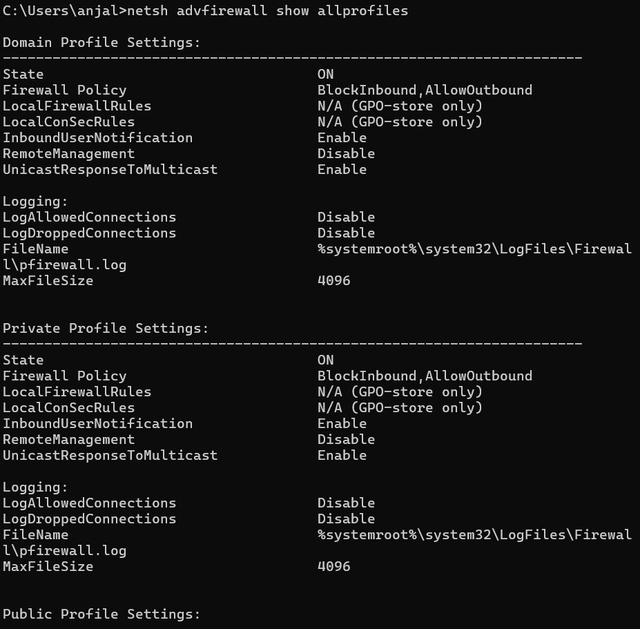
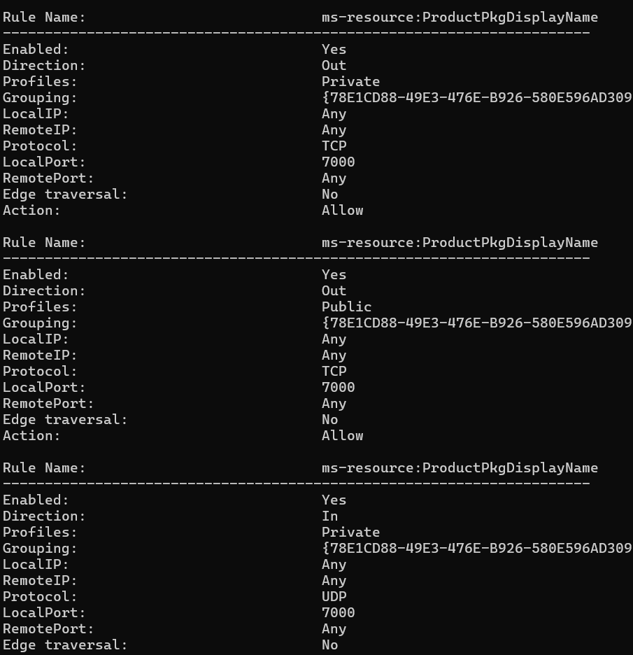

# Perimeter Security Orchestration & Ingress Control

**Name:** Anjali Godithi  
**Course:** IT 335  
**Date:** January 2026  
**Status:** Completed  

---

## 🎯 Objective
To implement a default-deny ingress firewall policy, allow only required services, and verify enforcement through controlled connectivity testing.

---

## 🛠️ Tools Used
- Windows PowerShell
- Windows Defender Firewall
- netsh advfirewall
- Test-NetConnection

---

## 🔍 Implementation Summary
1. Verified baseline firewall status
2. Enabled firewall and applied default ingress deny
3. Allowed approved ports only
4. Performed block test and allow test to validate enforcement

---

## ✅ Commands Executed
```bash
netsh advfirewall show allprofiles
netsh advfirewall firewall show rule name=all
```

## Proofs


